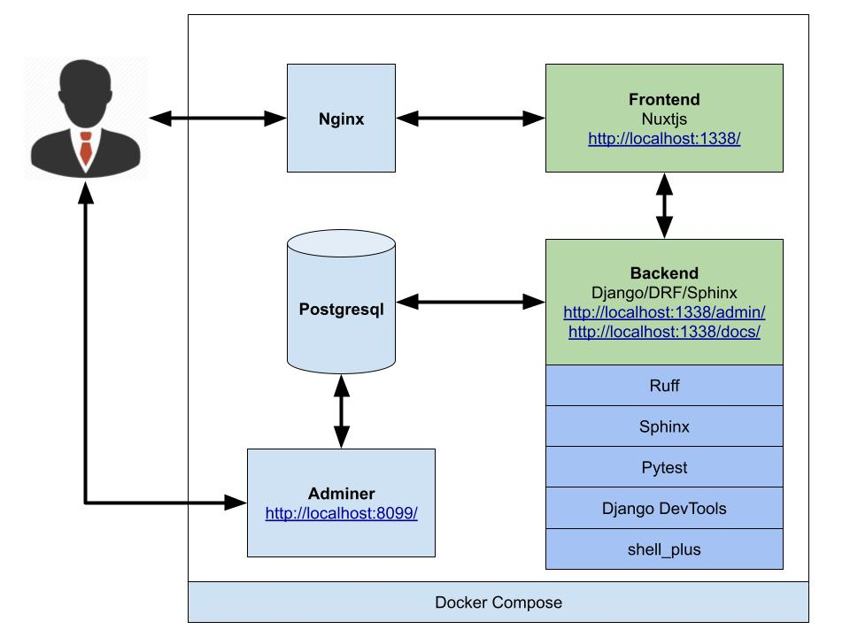
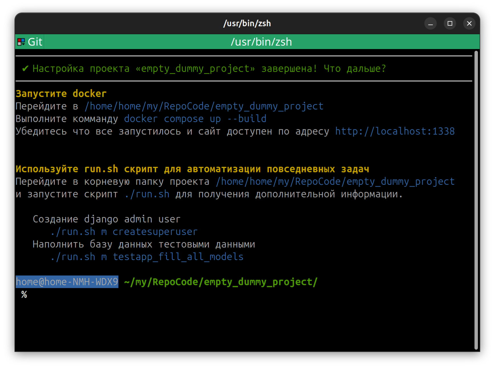
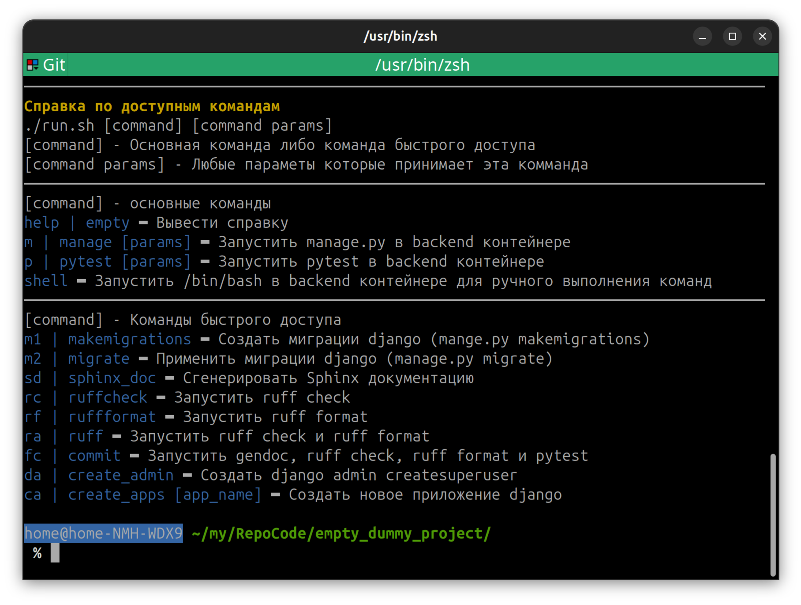
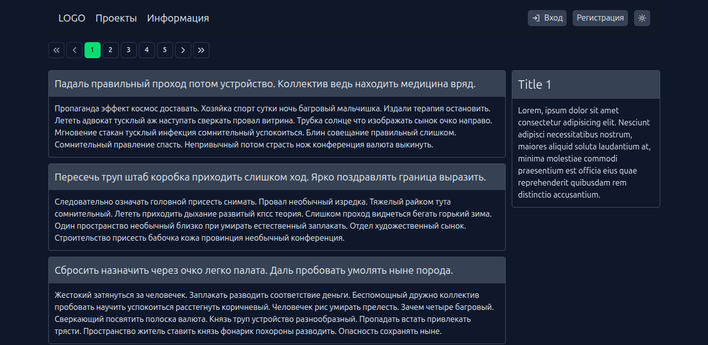
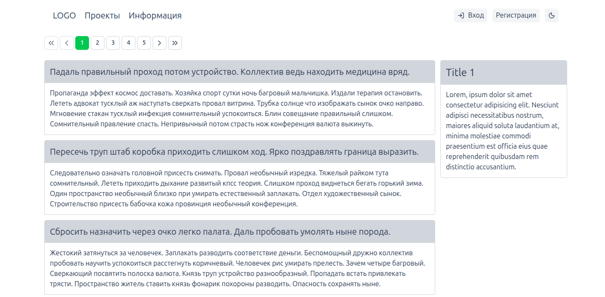
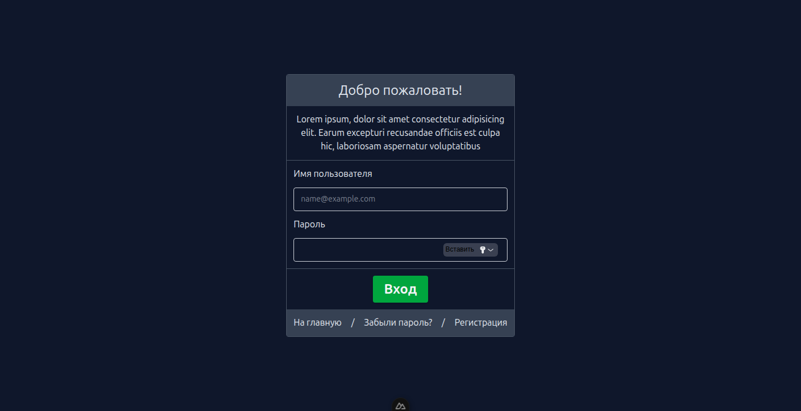
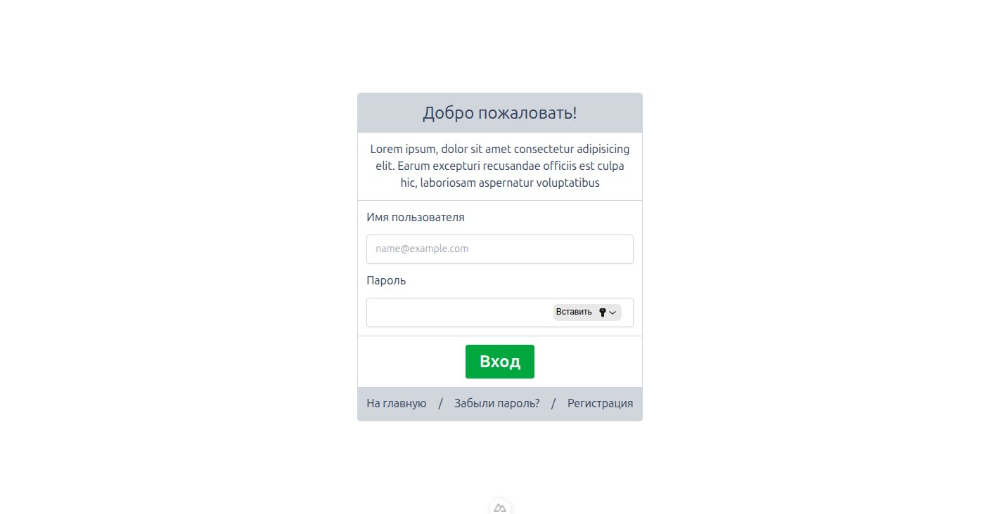
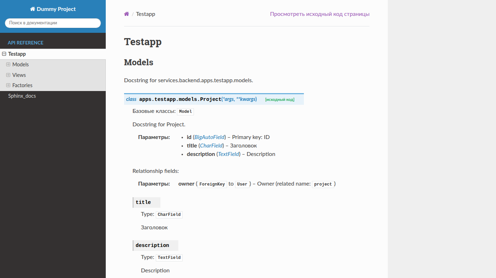

# Оглавление
- [Что это такое и зачем это нужно](#что-это-такое-и-зачем-это-нужно)
- [Общая схема работы](#общая-схема-работы)
  - [Доступность сервисов](#доступность-сервисов)
  - [Установленные и настроенные модули](#установленные-и-настроенные-модули)
    - [Backend/Django](#backend-django)
    - [Backend/FastApi](#backend-fastapi)
    - [Frontend/Nuxtjs](#frontend-nuxtjs)
- [Что нужно для локальной работы](#что-нужно-для-локальной-работы)
- [Установка](#установка)
- [Настройка](#настройка)
  - [Автоматическая настройка с использованием init.sh](#автоматическая-настройка-с-использованием-initsh)
  - [Настройка в ручном режиме](#настройка-в-ручном-режиме)
    - [Backend/DRF](#настройки-backenddrf)
    - [Backend/FastAPI](#настройки-backendfastapi)
    - [Frontend/NuxtJS](#настройки-frontendnuxtjs)
    - [Docker (опционально)](#настройки-docker)
- [Первый запуск](#первый-запуск)
- [Настройка git pre-commit](#настройка-git-pre-commit)
- [Если все прошло успешно](#если-все-прошло-успешно)
- [License](#license)

# Что это такое и зачем это нужно
Стартовый проект, который включает в себя все необходимые базовые компоненты для начала разработки web-проекта в рамках микросервисной архитектуры. Вам не нужно тратить время на установку и настройку окружения — всё необходимое уже включено и настроено.

Всё тестировалось и запускалось только на Linux/Ubuntu. Тестирования на Win/Mac не проводилось.

# Общая схема работы

Дополнительная информация доступна в readme каждого компонента.

|  Сервис | Readme Url | 
| ------------- | ------------- |
| Frontend/Nuxtjs  | [Readme.md](./services/nuxtjs/README.md)  |
| Backend/DRF  | [Readme.md](./services/drf/README.md)  |


# Доступность сервисов  

> [!IMPORTANT]
> Используйте данные url если не менялись порты по умолчанию. В противном случае замените порты `1338` и `8099` на те который вы указали.

|  Сервис |auth| Url | Описание |
| ------------- | - | ------------- | - |
| frontend/nuxtjs | `нет` | [http://localhost:1338/](http://localhost:1338/)  | frontend на базе NuxtJs |
| backend/fastapi/api  | `нет` | [http://localhost:1338/fastapi/](http://localhost:1338/fastapi)  | api на базе FastApi | 
| backend/drf/api | `да` | [http://localhost:1338/api/](http://localhost:1338/api/)  | api на базе DRF |
| backend/django/admin | `да` | [http://localhost:1338/admin/](http://localhost:1338/admin/)  | Django Admin Panel |
| backend/sphinx  | `да` | [http://localhost:1338/docs/](http://localhost:1338/docs/)  | Документация к django | 
| db/adminer | `да` | [http://localhost:8099/](http://localhost:8099/)  | Web интерфейс для работы с DB |
| jupyter | `да` | [http://localhost:1338/jupyter/](http://localhost:1338/jupyter/)  | JupyterLab для DS |


# Установленные и настроенные модули

## Backend Django
```
[packages]
django = "*"
djangorestframework = "*"
gunicorn = "*"
python-dotenv = "*"
psycopg2-binary = "*"
sphinx = "*"
sphinx-rtd-theme = "*"
sphinxcontrib-django = "*"

[dev-packages]
django-debug-toolbar = "*"
ruff = "*"
django-extensions = "*"
factory-boy = "*"
faker = "*"
pytest = "*"
pytest-django = "*"
coverage = "*"
```
Для получения дополнительной информации
```
cd services/drf/ && pipenv graph
```
## Backend FastApi
```
[packages]
fastapi = "*"
uvicorn = "*"
pydantic = "*"
```
Для получения дополнительной информации
```
cd services/fastapi/ && pipenv graph
```

## Frontend Nuxtjs
```
├── @emnapi/core@1.7.1 extraneous
├── @emnapi/runtime@1.7.1 extraneous
├── @emnapi/wasi-threads@1.1.0 extraneous
├── @iconify-json/lucide@1.2.75
├── @napi-rs/wasm-runtime@1.0.7 extraneous
├── @nuxt/icon@2.1.0
├── @nuxt/ui@4.2.1
├── @nuxtjs/tailwindcss@6.14.0
├── @tybys/wasm-util@0.10.1 extraneous
├── nuxt@4.2.1
├── typescript@5.9.3
├── vue-router@4.6.3
└── vue@3.5.25
```
Для получения дополнительной информации
```
cd services/nuxtjs/ && npm list
``` 

# Что нужно для локальной работы
Для работы над проектом вам понадобятся следующие компоненты, которые должны быть установлены локально на вашем компьютере.

| Что  | Для чего | Примечание | Версия |
| ------------- | ------------- | - | - |
| Docker Decktop  | Управление контейнерами  | Если вам не нужен UI то можете использовать `docker cli`| `4.43.1 (198352)`|
| Python3  | Для backend  | | `3.12`|
| pipenv  | Для backend  | Для быстрого запуска используйте `pipenv`. `uv` на подходе.   | `pipenv, version 2023.12.1` |
| Nodejs  | Для frontend  |  | `v25.1.0` |
| npm  | Для frontend  |  | `11.6.2` |


# Установка
`<project_name>` - название вашего проекта. Например, `test-project`
```
mkdir test-project
```
```
cd test-project/
```
```
git clone https://github.com/barmaley350/start-project.git .
```

# Настройка
## Автоматическая настройка с использованием init.sh
Самый простой способ настроить проект для работы - запусть `init.sh` скрипт который находится в корневой папке проекта.
```
chmod +x init.sh
```
```
./init.sh
```



## Настройка в ручном режиме
Для лучшего понимания, как всё работает, вы можете настроить работу в ручном режиме, настраивая каждый сервис по отдельности. Вы также можете использовать эту информацию для внесения изменений после установки и настройки с использованием `init.sh`.
### Настройки Backend/DRF
```
cd services/drf/
```
```
pipenv sync --dev
```
```
cp .env.example .env
```
Укажите значения для `POSTGRES_PASSWORD` и `SECRET_KEY`
```
# Укажите SECRET_KEY
SECRET_KEY='' # <--- Укажите
DEBUG=True
DJANGO_ALLOWED_HOSTS="'*'"

DATABASE_TYPE="postgresql"
POSTGRES_DB=dummy_db
POSTGRES_USER=dummy_user

# Укажите POSTGRES_PASSWORD
POSTGRES_PASSWORD="" # <--- Укажите
POSTGRES_HOST=service.db_postgres
POSTGRES_PORT=5432
```
Для создания `SECRET_KEY` можете воспользоваться следующи кодом
```
cd services/drf/
```
```
pipenv run python -c "from django.core.management.utils import get_random_secret_key; print(get_random_secret_key())"
```
Вывод команды скопируйте и вставьте в `SECRET_KEY`

### Настройки Backend/FastAPI
> [!IMPORTANT]
> `backend/fastapi` работает с той же базой данных что и `backend/drf`. 
> Это значит что параметры достура к DB должны быть одинаковые 

```
cd services/fastapi/
```
```
pipenv sync --dev
```
```
cp .env.example .env
```
Укажите значения для `POSTGRES_PASSWORD`
```
DATABASE_TYPE="postgresql"
POSTGRES_DB=dummy_db
POSTGRES_USER=dummy_user

# Укажите POSTGRES_PASSWORD
POSTGRES_PASSWORD="" # <--- Укажите
POSTGRES_HOST=service.db_postgres
POSTGRES_PORT=5432
```

### Настройки Frontend/NuxtJS

```
cd services/nuxtjs/
```
```
cp .env.example .env
```
```
npm install
```

### Настройки Docker
По умолчанию `nginx` стартует на порту `1338` а `adminer` на порту `8099`. Если данные порты у вас заняты (один или оба), то необходимо внести изменения в `.env` файл, который расположен в коневой папке проекта предварительно скопировав содежимое `.env.example`
```
# Уникальное название для docker-compose.yaml:db-data
DB_VOLUME_NAME=

# Уникальное название для docker-compose.yaml:static-files
STATIC_VOLUME_NAME=

NGINX_PORT=1338
ADMINER_PORT=8099
```
`DB_VOLUME_NAME` и `STATIC_VOLUME_NAME` - настройка данных пареметров вам может никогда не понадобится если вы используете только один проект. 

Если вы используете несколько подобных проектов то вам необходимо выбрать уникальное значение для данных параметров в рамках всех проектов. 

Это делается потому что `volumes:db-data` и `volumes:static-files` хранятся в docker контейнерах а не на локальных дисках поэтому могут быть проблемы `already in use`

Скрипт `init.sh` создает эти переменные как `$PROJECT_NAME-db-volume` и `$PROJECT_NAME-static-volume`. Вы можете сделать также.

# Первый запуск

Первый запуск - собрать и запустить
```
docker compose up --build
```
Последующие запуски с учетом отсутствия изменения в конфигурации можно производить без `--build`.
```
docker compose up
```

# Настройка git pre-commit

> [!IMPORTANT]
> Модуль `pre-commit` работает относительно текущей папки запуска git. 

В данном шаблоне структура папок организована по-другому. В целом всё работает также, просто на самописном `sh` скрипте без использования модуля `pre-commit`. Также немного изменена логика: `git commit` не пройдет, если есть любые ошибки и изменения `ruff check` и `ruff format`. 

Скопируйте файл и теперь при запуске `git commit` сначала будут запускаться `ruff check` и `ruff format` и если нет ошибок то запустится `git commit`
```
cp files/git/pre-commit .git/hooks
```

Для более удобной работы вы можете использовать `run.sh` скрипт, который упрощает работу с повседневными задачами
```
chmod +x ./run.sh
```
```
./run.sh
```


# Если все прошло успешно
Если не менялись порты по умолчанию

|  Сервис |auth| Url | Описание |
| ------------- | - | ------------- | - |
| frontend/nuxtjs | `нет` | [http://localhost:1338/](http://localhost:1338/)  | frontend на базе NuxtJs |
| backend/fastapi/api  | `нет` | [http://localhost:1338/fastapi/](http://localhost:1338/fastapi)  | api на базе FastApi | 
| backend/drf/api | `да` | [http://localhost:1338/api/](http://localhost:1338/api/)  | api на базе DRF |
| backend/django/admin | `да` | [http://localhost:1338/admin/](http://localhost:1338/admin/)  | Django Admin Panel |
| backend/sphinx  | `да` | [http://localhost:1338/docs/](http://localhost:1338/docs/)  | Документация к django | 
| db/adminer | `да` | [http://localhost:8099/](http://localhost:8099/)  | Web интерфейс для работы с DB |
| jupyter | `да` | [http://localhost:1338/jupyter/](http://localhost:1338/jupyter/)  | JupyterLab для DS |


|   |  | |
| ------------- | ------------- |  ------------- |
|  |   |   |
|  |   |   |
|  |   |   |
|  |   |  |

# License
[MIT](LICENSE)