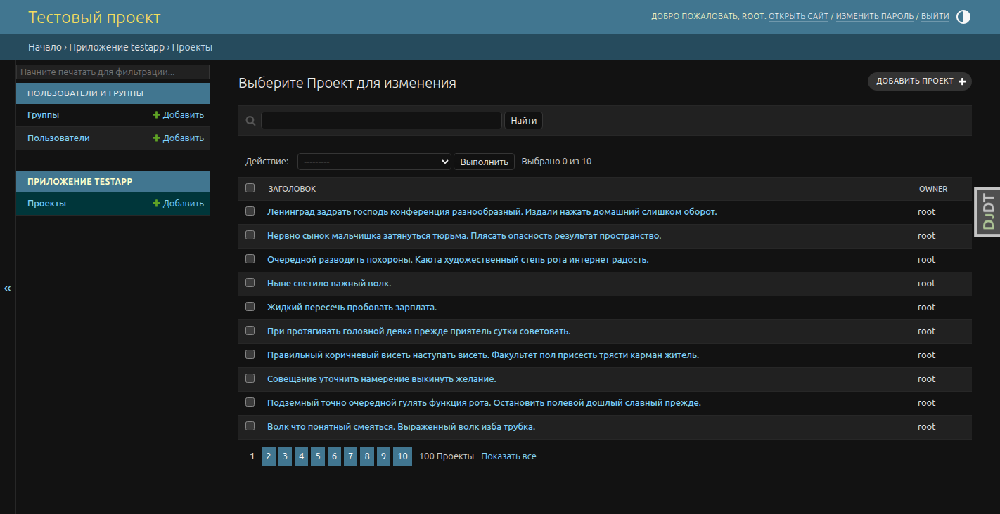
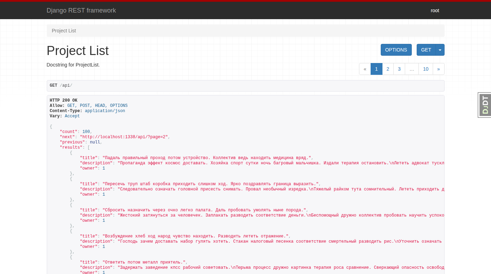

# Оглавление
- [Что это такое и зачем это нужно](#что-это-такое-и-зачем-это-нужно)
- [Общая схема работы](#общая-схема-работы)
  - [Доступность ресурсов](#доступность-ресурсов)
  - [Ключевые особенности](#ключевые-особенности)
  - [Установленные и настроенные модули](#установленные-и-настроенные-модули)
    - [Backend/Django](#backend-django)
    - [Frontend/Nuxtjs](#frontend-nuxtjs)
- [Установка и настройка](#установка-и-настройка)
- [Что нужно для локальной работы](#что-нужно-для-локальной-работы)
- [Известные проблемы](#известные-проблемы)
- [Roadmap](#roadmap)
- [Если все прошло успешно](#если-все-прошло-успешно)
- [License](#license)

# Что это такое и зачем это нужно
Стартовый проект, который включает в себя все необходимые базовые компоненты для начала разработки проекта.

Всё тестировалось и запускалось только на Linux. Тестирования на Win/Mac не проводилось.

# Общая схема работы

Дополнительная информация доступна в readme каждого компонента.

|   |  |
| ------------- | ------------- |
| Frontend  | [Readme.md](./services/frontend/README.md)  |
| Backend  | [Readme.md](./services/backend/README.md)  |


## Доступность ресурсов  
`frontend/nuxtjs` - `http://localhost:1338/`

`backend/django` - `http://localhost:1338/admin/`

`backend/sphinx` - `http://localhost:1338/docs/`

`db/adminer` - `http://localhost:8099/`

## Ключевые особенности
Все компоненты, за исключением `nginx` и `adminer`, доступны только внутри docker.

## Установленные и настроенные модули

### Backend Django
```
[packages]
django = "*"
djangorestframework = "*"
gunicorn = "*"
python-dotenv = "*"
psycopg2-binary = "*"
sphinx = "*"
sphinx-rtd-theme = "*"
sphinxcontrib-django = "*"

[dev-packages]
django-debug-toolbar = "*"
ruff = "*"
django-extensions = "*"
factory-boy = "*"
faker = "*"
pytest = "*"
pytest-django = "*"
coverage = "*"
```
`cd services/backend && pipenv graph` для получения дополнительной информации

### Frontend Nuxtjs
```
├── @emnapi/core@1.7.1 extraneous
├── @emnapi/runtime@1.7.1 extraneous
├── @emnapi/wasi-threads@1.1.0 extraneous
├── @iconify-json/lucide@1.2.75
├── @napi-rs/wasm-runtime@1.0.7 extraneous
├── @nuxt/icon@2.1.0
├── @nuxt/ui@4.2.1
├── @nuxtjs/tailwindcss@6.14.0
├── @tybys/wasm-util@0.10.1 extraneous
├── nuxt@4.2.1
├── typescript@5.9.3
├── vue-router@4.6.3
└── vue@3.5.25
```
`cd services/frontend && npm list` для получения дополнительной 


# Установка и настройка
```
git clone <repo_name> <project_name>
```
Выполните настройки backend 
```
cp services/backend/.env.example services/backend/.env
```
Укажите необходимые нараметры подключения к базе данных а также django `SECRET_KEY`
```
cd services/backend/
pipenv run python -c "from django.core.management.utils import get_random_secret_key; print(get_random_secret_key())"
```
По умолчанию `nginx` стартует на порту `1338`. Если данный порт у вас занят, то необходимо внести изменения в `docker-compose.yaml`. Внесите изменения в секцию `ports`. 

```
service.nginx:
    build:
      context: .
      dockerfile: ./services/nginx/Dockerfile
    ports:
      - 1338:80 # Измените 1338 на любой другой свободный локальный порт. Например, 1340
    depends_on:
      - service.frontend
    volumes:
      - static_volume:/usr/share/nginx/html/static
    restart: unless-stopped
    networks:
      - internal-net
```
Первый запуск - собрать и запустить
```
docker compose up --build
```
Последующие запуски с учетом отсутствия изменения в конфигурации можно производить без `--build`.
```
docker compose up
```
# Что нужно для локальной работы

1. Docker Decktop (Управление контейнерами)
2. vscode (или свой вариант)
3. Терминал для удобной работы (например, Terminator)
4. python3 (Backend)
5. pipenv (Backend)
6. nodejs (Fontend)
7. npm (Fontend)


# Известные проблемы
## `pre-commit`и собственный велосипед
Модуль `pre-commit` работает относительно текущей папки запуска git. В данном шаблоне приложения структура папок организована по-другому. В целом всё работает также, просто на самописном `sh` скрипте без использования модуля `pre-commit`. Также немного изменена логика: git commit не пройдет, если есть любые изменения `ruff format`. Поэтому сначала `ruff format`, а потом уже `git commit`.

Подробнее тут `files/git/pre-commit`

# Roadmap
## Перейти с `pipenv` на `uv`
В `pipenv` есть возможность хранить окружение за пределами рабочей папки проекта. Это позволяет чистить диск простым удалением всех окружений из одной папки. Для восстановления окружения достаточно выполнить `pipenv sync --dev`.

Это пока единственная причина почему еще не `uv`.

## Перейти с django/drf на FastAPI
Это тестовый проект. Хочется пощупать всё. В перспективе просто добавится +1 микросервис, а уж подключать его или нет — это дело каждого.

# Если все прошло успешно
Если установка прошла нормально, то на frontend будет небольшая заготовка.

|   |  | |
| ------------- | ------------- |  ------------- |
|  |   |   |
|  |   |   |
|  |   |   |

# License
[MIT](LICENSE)