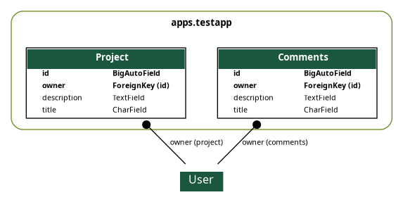
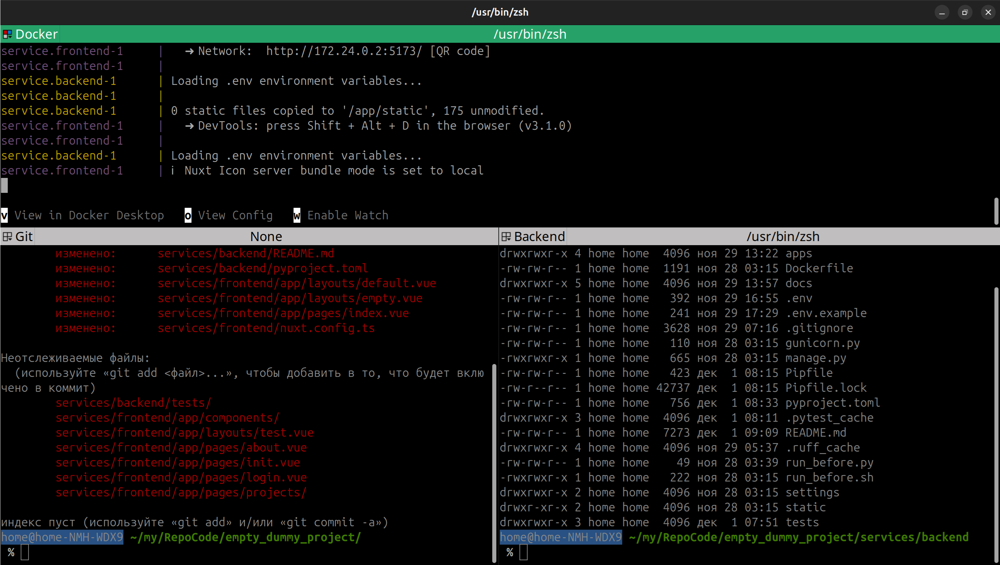

# Оглавление 
Все приводимые команды выполняются в каталог `services/drf` если явно не сказано использовать другой каталог.

`<project_name>` - название корневой папки вашего проекта

- [Скрипт run.sh](#скрипт-run-sh)
- [Как посмотреть установленные модули](#как-посмотреть-установленные-модули)
- [Как создать django admin superuser](#как-создать-django-admin-superuser)
- [Как создать новое приложение django](#как-создать-новое-приложение-django)
- [Как наполнить базу данных тестовыми данными](#как-наполнить-базу-данных-тестовыми-данными)
- [Как использовать shell plus](#как-использовать-shell-plus)
- [Генерация документации Sphinx](#генерация-документации-sphinx)
- [Как запускать тесты PyTest](#как-запускать-тесты-pytest)
- [Как работать с Ruff](#как-работать-с-ruff)
- [Настройка рабочего окружения для комфортной работы](#настройка-рабочего-окружения-для-комфортной-работы)

# Скрипт run sh
Практически все повседневные операции вы можете выполнять, используя скрипт `run.sh`. Это удобно и избавляет от необходимости запоминания и ввода длинных команд. 
```
chmod + run.sh
```
```
./run.sh
```


Вы также можете создать `command alias` в используемом вами `shell` для запуска скрипта из любого места. Например, для `zsh` в `~/.zchrc` можно добавить `alias`
```
alias barmaley='/bin/bash /home/home/my/RepoCode/empty_dummy_project/run.sh'
```
Где `barmaley` имя вашей команды. Вместо `barmaley` вы можете выбрать любое имя которое не является существующей командой в вашей системе. Это очень удобно и экономит массу времени.

# Как посмотреть установленные модули
Посмотреть все используемые модули можно в файле `Pipfile` или выполнив команду 
```
pipenv graph
```

# Как создать django admin superuser
Для создания superuser django admin выполните комманду. `<project_name>` замените на название корневой папки вашего проекта

```
docker exec -it <project_name>-service.drf-1 pipenv run python3 manage.py createsuperuser
```
Либо с использованием `run.sh`
```
./run.sh ca
```

# Как создать новое приложение django
Приложения будут храниться в отдельной папке `apps` для более удобной организации структуры проекта. Перед создание приложения необходимо предварительно создать папку приложения. 

`mkdir apps/<app_name>` а затем выполнить команду

```
pipenv run python3 manage.py startapp <app_name> apps/<app_name>
```
Либо с использованием `run.sh`
```
./run.sh ca app_name
```

После установки приложения необходимо изменить `name` в `apps/<app_name>/apps.py` на `apps.<app_name>`

Также не забываем добавить приложение в `settings/settings.py` в раздел `INSTALLED_APPS` в формате `apps.<apps_name>`

# Как наполнить базу данных тестовыми данными
В проекте по умолчанию создано приложение `apps/testapp` со следующей структурой.



Самый простой способ наполнить базу тестовыми данными это воспользоваться командой
```
./run.sh manage filling_models
```
`filling_models` это команда уровня приложения `testapp` которую можно запускать обычным способом используя `manage.py`

Для сравнения, вот как эта же команда запускается напрямую через Docker.
```
docker exec -it <project_name>-service.drf-1 pipenv run python3 manage.py filling_models
```

Наполнить модель данными можно также через `shell_plus`
который уже установлен и минимально настроен в файле `settings/setting.py` для использования `apps/testapp/factories.py`. 
```
# shell_plus settings
SHELL_PLUS_IMPORTS = [
    "from apps.testapp.factories import *",  # Imports all factories from factories.py
]
```
Просто запустите 
```
./run.sh manage shell_plus
```
Для сравнения, вот как эта же команда запускается напрямую через Docker.
```
docker exec -it <project_name>-service.drf-1 pipenv run python3 manage.py shell_plus
```
Где `<project_name>` название корневой папки вашего проекта. 
После успешного выполенения команды можем наполнить модель `Project` из `apps/testapp/models.py` произвольными данными
```
>>> ProjectFactory.create_batch(100)
>>> Project.objects.count()
100
>>> p = Project.objects.get(pk=1)
>>> p.title
'Падаль правильный проход потом устройство. Коллектив ведь находить медицина вряд.'
>>> p.description
'Пропаганда эффект космос доставать. Хозяйка спорт сутки ночь багровый мальчишка. Издали терапия остановить.\nЛететь адвокат тусклый аж наступать сверкать провал витрина. Трубка солнце что изображать сынок очко направо. Мгновение стакан тусклый инфекция сомнительный успокоиться.\nБлин совещание правильный слишком. Сомнительный правление спасть. Непривычный потом страсть нож конференция валюта выкинуть.'
>>> 
```

# Как использовать shell plus
```
./run.sh manage shell_plus
```
Для сравнения, вот как эта же команда запускается напрямую через Docker.
```
docker exec -it <project_name>-service.drf-1 pipenv run python3 manage.py shell_plus
```

# Генерация документации Sphinx
Документация доступна по адресу [http://localhost:1338/docs/](http://localhost:1338/docs/)


Рабочая папка, в которой хранится документация, — `service/backend/docs`. Для того чтобы запретить произвольный доступ к документации, был создан модуль `sphinx_docs`, основная задача которого — ограничивать доступ к документации неавторизованным пользователям.

Для генерации документации необходимо выполнить 
```
./run.sh sd
```
Более подробная информация о Sphinx доступна на 
[официальном сайте](https://www.sphinx-doc.org/en/master/)


# Как запускать тесты PyTest
В данном проекте для работы с тестами используется модуль python `pytest`
```
./run.sh p [params]
```
Где `[params]` параметры которые может принимать модуль python `pytest` 
# Как работать с Ruff
## `pre-commit`и собственный велосипед
Модуль `pre-commit` работает относительно текущей папки запуска git. В данном шаблоне приложения структура папок организованна по другому. В целом все работает также просто на самописном `sh` скрипте без использования модуля `pre-commit`. Также немного изменена логика - git commit не пройдет если есть любые изменения `ruff format`. Поэтому счала `ruff fromat` а потому уже `git commit` 

Для того чтобы данный функционал разаботал необходимо выполнить комманду 
```
cp files/git/pre-commit .git/hooks
```
Настроки `ruff` находятся тут `services/drf/pyproject.toml`. По умолчанию включена проверка всего что есть. 

Запуск `ruff` в ручном режиме
```
./run.sh rc | ruffcheck ━ Запустить ruff check 
```
```
./run.sh rf | ruffformat ━ Запустить ruff format 
```
```
./run.sh ra | ruff ━ Запустить ruff check и ruff format
```
# Настройка рабочего окружения для комфортной работы


Вы также можете настроить терминал как вам удобно. Например, ubuntu terminal 


